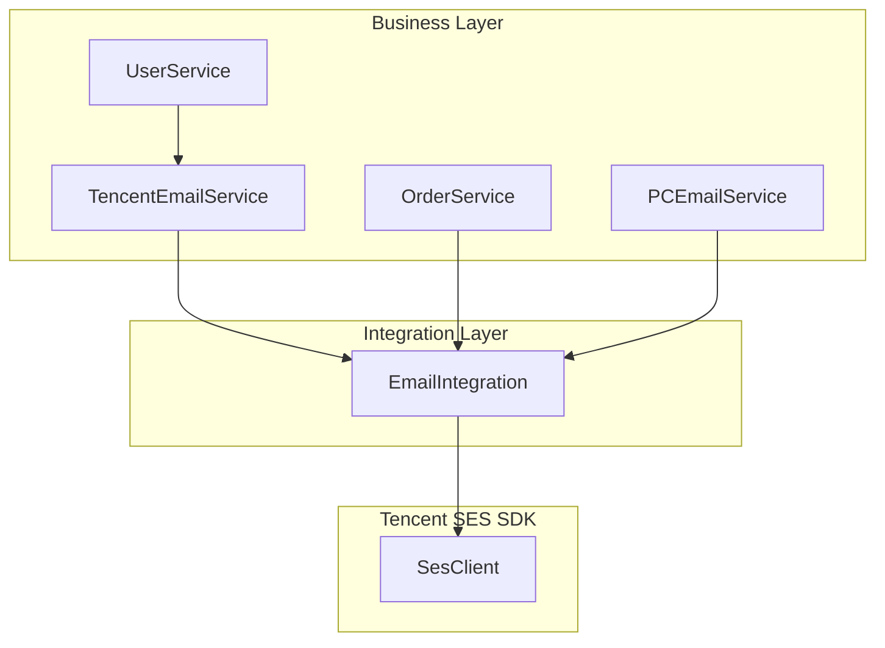
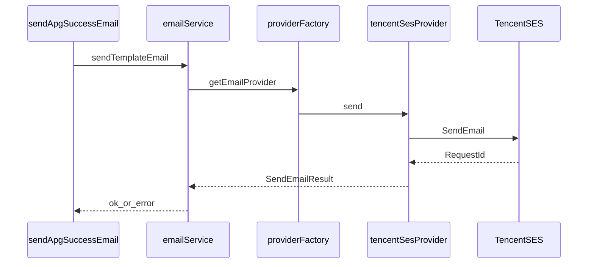

# Spark 邮件模块架构分析

本文档对齐 SpringBackend 腾讯 SES 邮件链路，并说明 Spark 侧落点与首期接入范围。

## 1. SpringBackend 调用关系

| 组件 | 路径 | 职责 |
|------|------|------|
| `EmailIntegration` | `BogdaService/.../integration/EmailIntegration.java` | SDK 初始化、`SendEmail` API |
| `TencentEmailService` | `BogdaService/.../logic/TencentEmailService.java` | 场景化 `templateData` |
| `TencentSendEmailRequest` | `BogdaCommon/.../request/TencentSendEmailRequest.java` | 请求 DTO |
| `MailChimpConstants` | `BogdaCommon/.../contants/MailChimpConstants.java` | 主题、发件人、CC |
| `TimeOutUtils` | `BogdaCommon/.../utils/TimeOutUtils.java` | 超时重试（3 次 / 5 分钟） |
| `EmailServiceImpl` | 审计落库 | Spark 首期不对齐 |

## 2. Spark 目标架构

落点：`app/server/email/`（禁止 `app/services/email/`）。

## 3. 配置映射

| Java (`ConfigUtils`) | Spark (`process.env`) | 默认 |
|----------------------|------------------------|------|
| `Tencent_Cloud_KEY_ID` | `TENCENT_CLOUD_KEY_ID` | — |
| `Tencent_Cloud_KEY` | `TENCENT_CLOUD_KEY` | — |
| 固定 `ap-hongkong` | `TENCENT_SES_REGION` | `ap-hongkong` |
| `MailChimpConstants.TENCENT_FROM_EMAIL` | `TENCENT_FROM_EMAIL` | `support@msg.ciwi.ai` |
| `CC_EMAIL` / `CC_EMAIL_ARRAY` | `TENCENT_SES_CC` | `feynman@ciwi.ai` |
| — | `EMAIL_PROVIDER` | `tencent` |
| — | `EMAIL_SEND_TIMEOUT_MS` | `300000` |
| — | `EMAIL_SEND_MAX_RETRIES` | `3` |
| — | `EMAIL_ENABLED` | `true`（设为 `false` 可全局关闭） |

## 4. API 字段对应

| `SendEmailRequest` (Spark) | 腾讯 SES `SendEmailRequest` |
|----------------------------|-----------------------------|
| `from` | `FromEmailAddress` |
| `to` | `Destination[0]` |
| `cc?` | `Cc[]` |
| `subject` | `Subject` |
| `templateId` | `Template.TemplateID` |
| `templateData` | `Template.TemplateData` (JSON string) |

成功判定：响应含非空 `RequestId`。

## 5. 模板 ID 清单

| templateId | 场景 | Java 来源 |
|------------|------|-----------|
| 137916 | 首次安装 | UserService |
| 137353 | 翻译成功 | TencentEmailService |
| 137317 | 翻译失败 | TencentEmailService |
| 140352 | 自动翻译完成 | TencentEmailService |
| 138372 | 字符购买成功 | OrderService |
| 146220 | 试用成功 | OrderService |
| 139251 / 146081 | 计划升级 | OrderService |
| 141470 / 141471 | IP 配额告警 | TencentEmailService |
| 143058 | 订阅到账 | TencentEmailService |
| 144208 | APG 初始化 | TencentEmailService |
| **144209** | **APG 生成成功** | **TencentEmailService.sendAPGSuccessEmail** |
| 144922 / 144923 | APG 购买 / 任务中断 | TencentEmailService |
| 156623 | IP 周报 | TencentEmailService |
| 158999–159005 | PC 图片翻译 | PCEmailService |
| 159294–159297 | 主题/语言/批量 | TencentEmailService |

首期 Spark 仅实现通用发送 + **144209** 场景封装。

## 6. 异常与重试

- Java：`sendEmailByTencent(TencentSendEmailRequest)` 使用 `TimeOutUtils.callWithTimeoutAndRetry`（3 次）。
- Spark：`retryWithTimeout.server.ts` 可配置次数与超时；Provider 内统一重试，避免 Java 双 Client 分歧。
- 失败码：`TENCENT_SEND_FAILED`（对齐 `MailChimpConstants`）。

## 7. 首期业务接入

**场景：** `sendApgSuccessEmail`（templateId `144209`）。

**触发：** `POST /api/generate-description` 成功且请求体 `notifyEmail=true` 时，由 HTTP 层调用（避免 AI Tool 单次生成误发批量邮件）。

**收件人：** Shopify Admin GraphQL `shop { email contactEmail }`，回退 `contactEmail`。

**templateData 字段：** `task_type`, `username`, `product_count`, `duration`, `credit_used`, `credit_remaining`（对齐 Java）。

## 8. 手动测试清单

1. 配置 `TENCENT_CLOUD_KEY_ID`、`TENCENT_CLOUD_KEY` 后重启应用。
2. `POST /api/generate-description`，body 含 `notifyEmail: true` 及正常 `productId` / `targetLanguage`。
3. 检查日志前缀 `[Email][Service]`、`[Email][Tencent]`，确认 `requestId` 或明确失败码。
4. 缺凭证时：`sendTemplateEmail` 应返回 `EMAIL_MISSING_CREDENTIALS`，HTTP 仍 200（邮件失败不阻断生成）。

## 9. 后续扩展

- 多 Provider（SES / SendGrid / SMTP）
- 失败降级、消息队列异步
- Prisma 发送审计
- 飞书/Webhook 告警
- 其余 templateId 场景按需迁移
