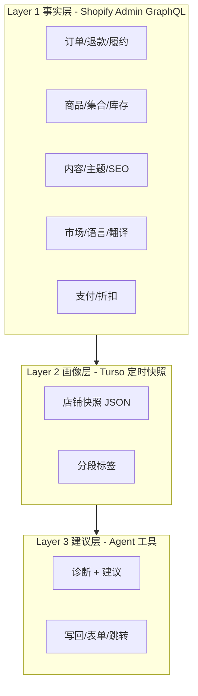

# 店铺洞察 Agent 路线图

本文档描述 Spark **AI Assistant** 向「深度理解商户店铺、提供商业建议并可执行工具」演进的规划。供后续分步实现时对照；实现时以仓库 **代码** 与 `docs/PROJECT_CONTEXT.md` 为准，有冲突时更新本文档。

**相关代码入口：**

- 聊天工具注册：`app/server/ai/skills/index.ts`、`app/server/ai/core/toolRegistry.server.ts`
- Shopify 指标工具：`app/server/ai/skills/shopifyInfo/tool.ts`
- 诊断报告页（7 日口径）：`app/routes/app.additional.tsx`
- 聊天流与画像占位：`app/server/chat-stream.ts`
- 商品描述 / 翻译 / 整图翻译：见 `docs/generateDescription.md`、`docs/translation-agent.md`

---

## 1. 目标

构建对用户商店了解较深的 AI Agent，能够：

1. 掌握店铺多维数据（经营、商品、库存、内容、市场、促销等）；
2. 给出可解释、可落地的商业建议；
3. 通过工具链完成「读 → 诊 → 做」（与现有 `generate_product_description`、翻译表单等衔接）。

**说明：** Shopify Dev MCP（`user-shopify-dev-mcp`）仅用于查文档与校验 GraphQL，**不能**替代 Admin API 拉取店铺数据。运行时数据一律走 `authenticate.admin` + `admin.graphql()`。

---

## 2. 现状：Agent 已具备能力

| 维度 | 已有能力 | 主要缺口 |
|------|----------|----------|
| 店铺身份 | 店名、域名、币种、时区、套餐 | 行业、市场/多币种、发货国家等 |
| 经营指标 | 销售额、订单、AOV、转化率*、弃购、退款、来源 `sourceName` | 无工具化环比/同比；无 Shopify Analytics 官方报表 |
| 库存 | 低库存 / 缺货 SKU 抽样 | 无周转率、无滞销 SKU 排行 |
| 商品 | `generate_product_description`、商品搜索 | 无目录健康度、定价/SEO 汇总 |
| 运营动作 | 翻译任务表单、整图翻译 | 无折扣/集合等运营写回（除商品描述） |
| 用户画像 | `UserProfile` 类型 + `chat-stream` 内 dummy | **未持久化** |
| 站外广告 | `AdPlatformCredential`（Turso） | **未接入 Agent 工具**（无 ROAS） |

\* **转化率口径：** `订单数 / (订单数 + 弃购数)`，为 checkout 近似，非 Sessions 漏斗转化。

### 2.1 当前聊天工具清单（`shopifyShopInfo`）

| 工具名 | 说明 |
|--------|------|
| `get_shopify_shop_info` | 店铺基础信息 |
| `get_shopify_app_scopes` | 已授权 scopes |
| `diagnose_shopify_order_access` | 订单权限诊断 |
| `get_shopify_today_sales` | 销售额（可 `days` 1–90） |
| `get_shopify_today_order_count` | 订单数 |
| `get_shopify_today_conversion_rate` | 转化率（checkout 口径） |
| `get_shopify_today_aov` | 客单价 |
| `get_shopify_today_source_performance` | 按 `sourceName` 聚合（无 ROAS） |
| `get_shopify_today_abandonment_rate` | 弃购率 |
| `get_shopify_today_refund_return_rate` | 退款率 / 退款金额 |
| `get_shopify_inventory_health` | 库存健康 |

### 2.2 其他已注册 Agent 工具

- `generate_product_description` — 商品营销描述
- `open_translation_task_form` — 翻译任务表单卡片
- `picture_translate` — 整图翻译
- `get_current_time` / `get_weather` — 基础工具

### 2.3 当前主 App scopes（参考 `shopify.app.test.toml`）

```
read_orders, write_products, read_locales
```

部分环境另有 `read_translations, write_translations`（见 `shopify.app.spark-zz.toml` 等）。

---

## 3. 目标架构：三层店铺理解



**原则：** Agent 对话默认读 **Layer 2 快照** + 按需刷新关键指标；避免每轮对话全量扫店（限流、延迟、scope 失败率）。

---

## 4. 可扩展数据面（按商业价值排序）

### P0 — 强烈建议（直接支撑商业建议）

#### 4.1 商品与目录（`read_products` 已有，需加深查询）

- 在售 / 草稿 / 归档数量；无图、无描述商品占比
- 价格带、`compareAtPrice`、多 variant 价差
- 集合（手动/智能）、标签、产品类型

| 建议工具名 | 返回要点 |
|------------|----------|
| `get_catalog_health` | 待优化商品 Top N、结构摘要 |

**建议场景：** 定价、上新、描述/图补齐 → 接 `generate_product_description`。

**Admin API 参考：** [product](https://shopify.dev/docs/api/admin-graphql/latest/queries/product)、[products](https://shopify.dev/docs/api/admin-graphql/latest/queries/products)

#### 4.2 订单深化（`read_orders`；客户维度常需 PCD）

在现有聚合上增加：

- 新客 vs 回头客、复购间隔、LTV 粗算
- 热销 / 滞销 SKU（订单 line items × 库存）
- 履约时效、取消率、折扣码使用率

| 建议工具名 | 返回要点 |
|------------|----------|
| `get_customer_and_repeat_metrics` | 复购与客群聚合（避免下发 PII） |
| `get_top_and_slow_skus` | 销量排行与滞销候选 |

#### 4.3 弃购与结账（部分已有 count）

- 弃购金额、弃购 line items、恢复率（视权限）
- 运费/支付相关信号（若 API 支持）

| 建议工具名 | 返回要点 |
|------------|----------|
| `get_abandoned_checkout_insights` | 比单纯 count 更可行动 |

#### 4.4 市场与本地化（与翻译业务协同）

- `shopLocales`、已发布市场、`TranslatableResource` 覆盖率
- 未翻译资源类型与数量

| 建议工具名 | 返回要点 |
|------------|----------|
| `get_localization_gaps` | 引导 `open_translation_task_form` |

**scope：** `read_locales`、`read_translations`（部分 toml 已有）

**参考：** [TranslatableResourceType](https://shopify.dev/docs/api/admin-graphql/latest/enums/TranslatableResourceType)

#### 4.5 店铺快照 + 分段（自建，Turso）

将诊断页（`app.additional.tsx`）7 日逻辑 + 商品/订单摘要 **定时写入 Turso**。

**建议表（草图）：** `ShopInsightSnapshot`

| 字段 | 说明 |
|------|------|
| `shop` | 店铺域名（唯一键之一） |
| `period` | 如 `7d` |
| `metrics` | JSON：销售、订单、AOV、转化、退款、库存率等 |
| `tags` | 如 `high_refund`、`low_conversion`、`stock_risk` |
| `updatedAt` | 快照时间 |

| 建议工具名 | 返回要点 |
|------------|----------|
| `get_shop_insight_snapshot` | 默认 Agent 读入口，快且稳定 |

**画像：** 将 `chat-stream.ts` 中 `dummyProfile` 改为读 Turso + 对话偏好（语气、关注点）。

---

### P1 — 中高价值（差异化）

#### 4.6 内容与流量入口

- Blogs / Articles / Pages：正文长度、更新频率、SEO meta 缺失
- 菜单、首页集合是否为空

**scope：** `read_content` 或 `read_online_store_pages`

| 建议工具名 | 返回要点 |
|------------|----------|
| `get_content_seo_health` | 内容营销、SEO 建议输入 |

**参考：** [articles](https://shopify.dev/docs/api/admin-graphql/latest/queries/articles)、[Article](https://shopify.dev/docs/api/admin-graphql/latest/objects/Article)

#### 4.7 折扣与促销

- 活跃 price rules、折扣码、自动折扣

**scope：** `read_price_rules` / `read_discounts`

| 建议工具名 | 返回要点 |
|------------|----------|
| `get_discount_summary` | 毛利保护、大促节奏 |

#### 4.8 履约与物流

- 未履约订单、发货延迟；与 `logisticsCredentialStore` 配置状态联动

**scope：** `read_fulfillments`、`read_shipping`

#### 4.9 支付与结账

- 支付方式、Shop Pay 等 → 弃购/支付成功率建议

#### 4.10 广告 ROAS（站外）

- 使用已有 `AdPlatformCredential`（Google / Meta / TikTok / Microsoft）
- 与各平台 Marketing API 拉 spend，与订单 `sourceName` 对齐

| 建议工具名 | 返回要点 |
|------------|----------|
| `get_ad_spend_and_roas` | 渠道预算建议（补全「来源销售无花费」缺口） |

**代码参考：** `app/server/adAuthCredentialStore.server.ts`

---

### P2 — 进阶 / 合规成本高

| 数据 | 方式 | 用途 | 注意 |
|------|------|------|------|
| 客户明细 | Orders + Customer | 分群、CRM 式建议 | **Protected Customer Data (PCD)** |
| Shopify Analytics / Reports | Admin Reports | 会话、漏斗 | scope 与店铺能力因店而异 |
| 商品评论 | App / metafields | 口碑、差评商品 | 常需第三方 |
| 站内搜索词 | Search & Discovery | SEO、缺货词 | 专用 API |
| 订阅 | Selling plans | 订阅电商 | 专用 scopes |
| B2B | Company locations | 批发 | Plus |
| 主题文件 | `theme.files` | UX、文案 | `read_themes` |

---

## 5. 建议工具形态（读 → 诊 → 做）

与 `globalToolRegistry` 模式对齐，在 `app/server/ai/skills/` 下按域分子目录实现。

### 5.1 读（Facts）

| 工具名 | 说明 | 优先级 |
|--------|------|--------|
| `get_shop_insight_snapshot` | 读 Turso 快照（对话默认入口） | P0 |
| `get_catalog_health` | 商品目录健康 | P0 |
| `get_top_and_slow_skus` | 热销/滞销 SKU | P0 |
| `get_localization_gaps` | 翻译/市场缺口 | P0 |
| `get_content_seo_health` | 内容/SEO | P1 |
| `get_discount_summary` | 折扣概览 | P1 |
| `get_abandoned_checkout_insights` | 弃购洞察 | P0 |
| `get_ad_spend_and_roas` | 广告花费与 ROAS | P1 |
| `refresh_shop_metrics` | 强制刷新最近 N 天（需限流） | P0 |

### 5.2 诊（Advice）

| 工具名 | 说明 | 优先级 |
|--------|------|--------|
| `run_shop_diagnosis` | 健康/关注/风险 + 可执行建议（对齐诊断页） | P0 |
| `compare_periods` | 本周 vs 上周（复用 `app.additional.tsx` loader） | P0 |
| `explain_metric` | 解释指标口径，防幻觉 | P1 |

### 5.3 做（Actions）

| 已有 | 可扩展 |
|------|--------|
| `generate_product_description` | 批量描述、集合描述 |
| `open_translation_task_form` | 根据 `get_localization_gaps` 预填 `resourceTypes` |
| `picture_translate` | 商品图 alt / 主图多语言 |
| — | `suggest_product_tags`（只建议，不写回） |
| — | `draft_discount_recommendation`（方案稿，确认后再 mutation） |
| — | 计费/配额引导（卫星 App `generate-description`） |

**写回原则：** 与 `update-product-description` 一致 — **预览 + 用户确认**，禁止 Agent 静默改店。

---

## 6. 信号 → 建议 → 工具映射

| 店铺信号 | 数据来源 | 建议类型 | 对接工具 |
|----------|----------|----------|----------|
| 弃购率高 + AOV 高 | 订单 + 弃购 | 结账优化、挽回 | 诊断 + 未来 marketing |
| 退款率升 | refunds | 质检/描述不符 | 商品描述生成 |
| 缺货 SKU 多 | variants | 补货优先级 | 加深 `get_shopify_inventory_health` |
| 大量商品无描述 | products | 内容补齐 | `generate_product_description` |
| 多市场未翻译 | translatableResources | 本地化 | `open_translation_task_form` |
| 来源仅 organic | sourceName | 投广告 | `get_ad_spend_and_roas` |
| 智能集合空 | collections | Merchandising | `get_catalog_health` |

---

## 7. Scope 与合规路线图

### 7.1 短期（不新增 PCD）

在现有 scopes 上可做：

- 商品目录健康、库存深化、集合、locales、翻译缺口
- 订单 **聚合** 深化（line items 统计）
- 弃购：从 count 扩展到金额/商品（视 API）

### 7.2 中期（扩展 `shopify.app.*.toml`）

建议按需追加（勿一次全开）：

```text
read_products
read_orders
read_locales
read_translations
write_translations
read_content
read_discounts
read_fulfillments
read_markets
read_themes
```

每次新增 scope 需：**更新 toml → 重新授权 → 文档记录 → 工具内 scope 诊断文案**（参考 `shopifyInfo/tool.ts` 的 `buildScopeDiagnostic`）。

### 7.3 长期（客户级洞察）

- 完成 Shopify **Protected Customer Data** 申报
- 客户工具只返回 **聚合结果**，不向 LLM 上下文注入原始 PII

---

## 8. 实施优先级（推荐顺序）

| 阶段 | 内容 | 产出 |
|------|------|------|
| **1** | Turso `ShopInsightSnapshot` + 定时任务（复用诊断页查询） | `get_shop_insight_snapshot` |
| **2** | `get_catalog_health`、`get_top_and_slow_skus` | 商品侧建议 |
| **3** | `get_localization_gaps` | 与翻译产品线转化 |
| **4** | 画像持久化，替换 `chat-stream` dummy `UserProfile` | 个性化 system prompt |
| **5** | `get_ad_spend_and_roas` + 广告凭证 | 渠道预算建议 |
| **6** | `get_content_seo_health`、`get_discount_summary` 等 | 扩 scope 后分批 |

每阶段建议：

1. GraphQL 查询 + 单测（可参考 `tests/app/server/ai/`）
2. 注册 `ToolDefinition` + `systemPromptExtension`
3. 更新本文档「实现状态」小节

---

## 9. 实现状态（实施时勾选）

| 项 | 状态 |
|----|------|
| `ShopInsightSnapshot` 表与迁移 | ⬜ |
| 快照定时写入 job | ⬜ |
| `get_shop_insight_snapshot` | ⬜ |
| `get_catalog_health` | ⬜ |
| `get_top_and_slow_skus` | ⬜ |
| `get_localization_gaps` | ⬜ |
| `get_abandoned_checkout_insights` | ⬜ |
| `run_shop_diagnosis` / `compare_periods` | ⬜ |
| `UserProfile` 持久化（v1：Cosmos+Blob 基础画像，见 `shop-profile.md`） | ✅ |
| `get_ad_spend_and_roas` | ⬜ |
| P1 内容与折扣工具 | ⬜ |
| Scope 扩展与重新授权说明（商户文档） | ⬜ |

---

## 10. 附录：Shopify 内容类型与 API 速查

| 内容类型 | Admin GraphQL 入口 | 典型字段 | 权限提示 |
|----------|-------------------|----------|----------|
| 商品 | `product` / `products` | `descriptionHtml`, metafields | `read_products` |
| 博客文章 | `articles` / `blog` | `body`, `summary` | `read_content` |
| 页面 | `pages` | body, handle, SEO | `read_content` |
| 主题文件 | `theme(id).files` | Liquid / JSON 源码 | `read_themes` |
| 可翻译资源 | `translatableResources` | 动态 key | `read_translations` |

HTML 正文统一建议：**拉取 → 去标签转纯文本**（参考 `app/server/generateDescription/productContextFetcher.server.ts` 的 `htmlToPlainText`）。

---

*文档版本：初稿，与 2026-05 代码库状态对齐。*
