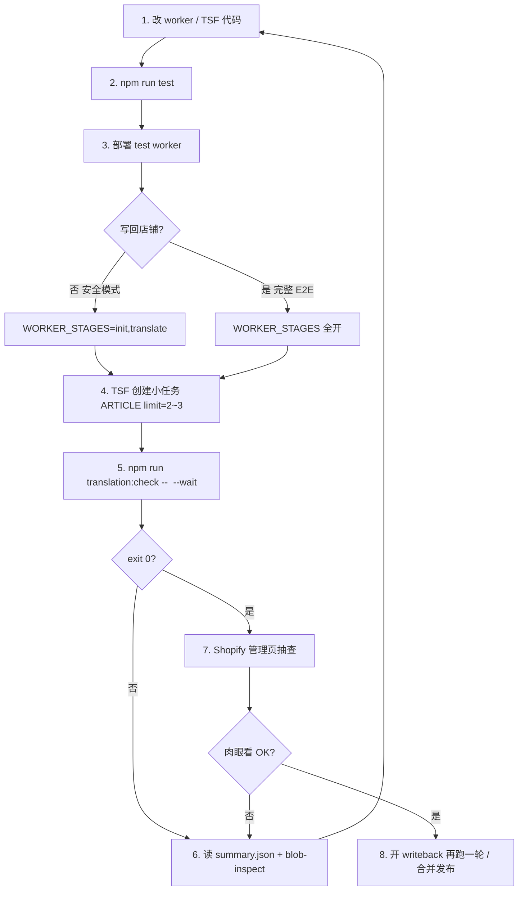

# 翻译 V4 迭代 Playbook

**用途**：在 TSF 创建任务 → Shopify 管理页验收 → 查 Cosmos/Blob 定位问题 → 改 worker/TSF → 再测，形成可重复闭环。

**一键诊断**：`npm run translation:check -- <jobId> [--wait]`

**相关文档**：
- [`TRANSLATION_AGENT.md`](./TRANSLATION_AGENT.md) — 流水线架构
- [`translation-quality-check.md`](./translation-quality-check.md) — Agent 深度质量分析（含 QPS 图）

---

## 你需要提供什么

| 项 | 是否必须 | 说明 |
|----|----------|------|
| 根目录 `.env` | **必须** | 见下方环境变量 |
| **jobId** | **必须** | TSF 翻译 V4 任务详情里的 UUID（可只写前 8 位前缀） |
| shop 域名 | 通常不用 | 脚本从 Blob 路径自动解析 `tasks/v4/{shop}/{jobId}/` |
| Shopify 登录 | 不用 | 查 Blob/Cosmos 不需要；管理页肉眼验收需人工 |
| 创建任务 API | 不用 | 任务仍在 **TSF TranslationV4Page** 手动创建（避免误触发生产写回） |

### `.env` 最小配置

```env
AZURE_BLOB_CONNECTION_STRING=...
COSMOS_ENDPOINT=...
COSMOS_KEY=...

# 可选（有默认值）
# AZURE_BLOB_TRANSLATION_CONTAINER=translation-content
# COSMOS_TRANSLATION_DATABASE_ID=translation
# COSMOS_TRANSLATION_V4_JOBS_CONTAINER=translation_v4_jobs
```

---

## 迭代闭环（推荐）



---

## 三种测试模式

| 模式 | Worker 配置 | 创建任务 | 验收 |
|------|-------------|----------|------|
| **本地单测** | 无 | 无 | `npm run test -- tests/worker/...` |
| **安全线上** | `WORKER_STAGES=init,translate` | TSF 小范围 | `translation:check` + exportReport（**不写 Shopify**） |
| **完整 E2E** | 默认全开 | TSF + 可选覆盖翻译 | 管理页 + `translation:check` + 写回详情 |

---

## 一键命令

```bash
# 任务已完成后诊断（最常用）
npm run translation:check -- e4a398ba

# 创建任务后自动等到 COMPLETED/FAILED 再诊断
npm run translation:check -- e4a398ba --wait

# 只等到翻译结束（写回前，配合 WORKER_STAGES=init,translate）
npm run translation:check -- e4a398ba --wait --until translate

# 指定输出目录 / 跳过 exportReport
npm run translation:check -- b533af43 --out ./tmp/playbook --no-report

# 机器可读 JSON
npm run translation:check -- b533af43 --json
```

**输出**：
- `translation-reports/<shop>-<jobId>/playbook/summary.json` — 结构化结论（CI/Agent 用）
- `translation-reports/.../playbook/export-report/report.json` — 全量质量 flags（若未 `--no-report`）

**退出码**：
- `0` — 默认检查项通过
- `1` — 发现问题（见 `summary.json` → `exitIssues`）
- `2` — 环境/参数错误

**默认 fail-on 规则**：`pipeline-failed`、`fake-completed`、`writeback-all-failed`、`verify-all-failed`、`init-missing-body`、`translate-empty-body`、`high-fallback`（>10%）

---

## 分步命令（与一键等价，便于手工深入）

```bash
# 列最近任务
node scripts/blob-inspect-translation.mjs

# 任务概览 + manifest
node scripts/blob-inspect-translation.mjs <jobId>

# init vs translate 对照（某模块 chunk）
node scripts/blob-inspect-translation.mjs <jobId> ARTICLE 0

# 质量指标扫描
node scripts/qps-quality-scan.mjs <jobId>

# init 大字段分布
node scripts/qps-bigfields.mjs <jobId>

# 全量报告
cd worker && npx tsx src/scripts/exportTranslationReport.ts <shop> <jobId>
```

---

## 问题定位决策树

| 现象 | 先查 | 常见原因 |
|------|------|----------|
| 管理页描述空 | `init` blob 有没有 `body_html` | init 过滤（如 HTML 含 `16px` 误杀）；或已有 pl 空译文占位 |
| init 无 body，Shopify 有内容 | `shouldIncludeFieldV2` / 空 pl 译文 | 已修：空译文仍纳入；HTML 走 `translationRuleJudgment` |
| translate 有、管理页空 | `writeback/failed.json`、metrics | handle 同值写回失败；token 过期 |
| 写回 0/17 却「已完成」 | Cosmos metrics | 旧逻辑 verify 后仍 COMPLETED；新 worker 标 FAILED |
| 长文 AIO 能翻、短文不能 | 对比 init 字段列表 | 不是长度问题，是 **没进 init** |
| 译文=原文 | exportReport `unchanged` | LLM 跳过 / 已是英文 / 术语表 |
| 任务卡住 | Cosmos status + Render worker 日志 | 额度暂停、僵死 reset 10min |

---

## TSF 创建任务建议（每轮迭代）

1. **小范围**：仅 `ARTICLE`，`limitPerType=2~3`
2. **首次验证 filter**：`WORKER_STAGES=init,translate`，确认 init/translate blob
3. **写回验证**：恢复 writeback/verify，必要时勾选 **覆盖翻译**
4. **同 shop+语言** 同时只能有一个进行中任务（409 互斥），需等上一任务终态

---

## 改代码后检查清单

- [ ] `npm run test -- tests/worker/translationFilter tests/worker/llmTranslate tests/worker/writebackFields`
- [ ] 部署 **spark-translation-worker-test**
- [ ] TSF 创建任务，复制 **jobId**
- [ ] `npm run translation:check -- <jobId> --wait`
- [ ] 若 fail：打开 `summary.json`，按 `code` 查决策树
- [ ] 若 pass：Shopify 管理页抽查 1~2 篇
- [ ] 完整 E2E 再跑一轮（含 writeback）

---

## 给 Cursor Agent 的提示词模板

```
请按 docs/translation-playbook.md 执行迭代诊断。
任务 ID：<jobId>
店铺：<shop.myshopify.com>（可选）

1. 运行 npm run translation:check -- <jobId>
2. 若有问题，读 translation-reports/.../playbook/summary.json
3. 用 blob-inspect 抽查 ARTICLE chunk 0
4. 给出根因与 worker/TSF 修改建议
```

深度质量（QPS 图、枚举误翻）仍用 [`translation-quality-check.md`](./translation-quality-check.md)。

---

## 文件索引

| 文件 | 作用 |
|------|------|
| `scripts/translation-playbook-check.mjs` | 一键诊断入口 |
| `scripts/lib/playbook-env.mjs` | Blob/Cosmos 公共连接 |
| `scripts/blob-inspect-translation.mjs` | 任务列表 / init-translate 对照 |
| `worker/src/scripts/exportTranslationReport.ts` | 全量质量 report |
| `scripts/qps-quality-scan.mjs` | noSrc / toTarget / fallback |
| `scripts/qps-bigfields.mjs` | init 大字段 Top20 |
